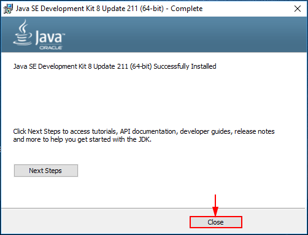

La siguiente guia nos permitirá configurar Maven correctamente.

# Requisitos

- JDK8 [Download](https://www.oracle.com/technetwork/java/javaee/downloads/jdk8-downloads-2133151.html)
- Maven [Download](https://maven.apache.org/download.cgi)

# Empezemos

Configurar la variable de entorno JAVA_HOME.





Verificar el funcionamiento de la variable
```bash
java -version
javac -version
```
