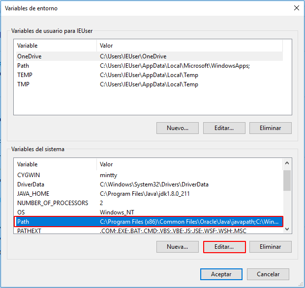

La siguiente guia nos permitirá configurar Maven correctamente.

# Requisitos

- Java SE Development Kit 8 [[Download]](https://www.oracle.com/technetwork/java/javaee/downloads/jdk8-downloads-2133151.html)
- Apache Maven [[Download]](https://maven.apache.org/download.cgi)

# Empezemos

Configurar la variable de entorno JAVA_HOME.





Verificar el funcionamiento de la variable
```bash
>java -version
java version "1.8.0_211"
Java(TM) SE Runtime Environment (build 1.8.0_211-b12)
Java HotSpot(TM) 64-Bit Server VM (build 25.211-b12, mixed mode)

>javac -version
javac 1.8.0_211
```

# Ahora vamos a configurar Apache Maven

Primero descargar y descomprimir.


Luego crear la variable de entorno M2_HOME y añadirla al PATH del sistema.


Verificar el funcionamiento de la variable
```bash
>mvn -version
Apache Maven 3.6.1 (d66c9c0b3152b2e69ee9bac180bb8fcc8e6af555; 2019-04-04T12:00:29-07:00)
Maven home: C:\apache-maven-3.6.1\bin\..
Java version: 1.8.0_211, vendor: Oracle Corporation, runtime: C:\Program Files\Java\jdk1.8.0_211\jre
Default locale: es_PE, platform encoding: Cp1252
OS name: "windows 10", version: "10.0", arch: "amd64", family: "windows"
```
